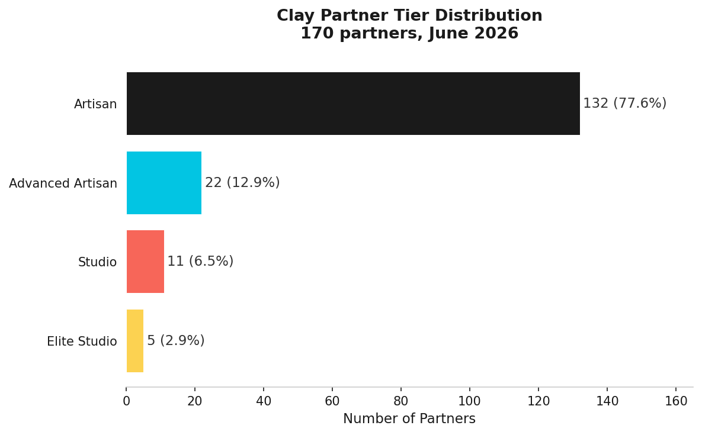
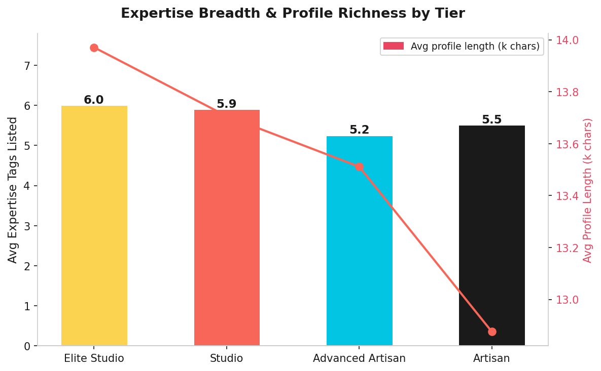
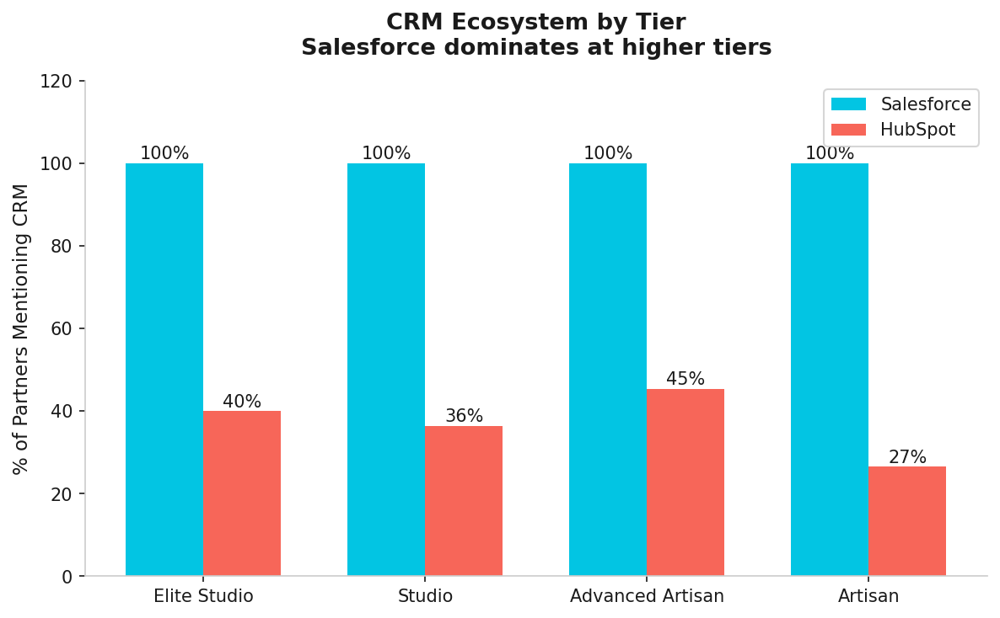
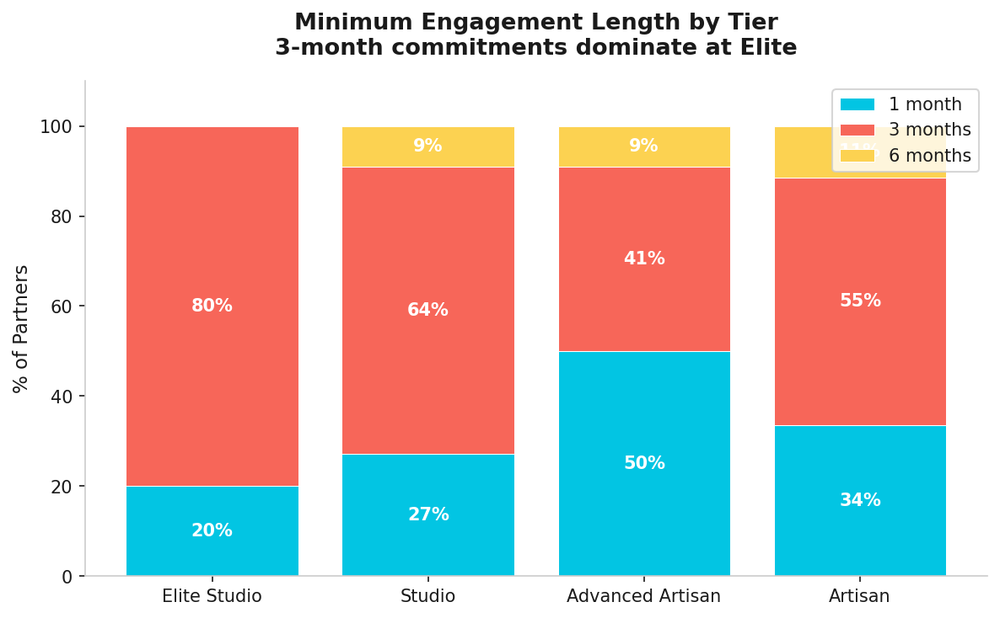

# Clay Partner Tier Progression Analysis

An analysis of Clay's public solutions-partner ecosystem (170 partners, June 2026),
exploring **what distinguishes partners who climb tiers** and producing a
recommendation the partnerships team could act on.

> Built using only publicly available data from [clay.com/experts](https://www.clay.com/experts).
> No private or proprietary data was used. Raw scraped data is not included in this repo.

---

## The Question

Clay tiers its 170+ partner agencies across four levels: Artisan, Advanced Artisan,
Studio, and Elite Studio. The partnerships team decides who gets promoted.

**What do promoted partners have in common that lower-tier partners don't?**

If those signals are detectable from a partner's public profile, Clay's partnerships
team could identify high-potential partners earlier and invest in accelerating their
progression.

---

## Key Findings

### 1. The tier pyramid is brutally steep

78% of Clay's 170 partners sit at the lowest Artisan tier. Only 5 have reached Elite.
That's a 26:1 ratio — Elite is a genuinely earned designation, not a participation badge.



---

### 2. Elite partners chase bigger customers

Every Elite partner targets "Growth stage startups (Series B-C)" and
"Mid-Market / Enterprise" ICPs. Artisan partners are far more scattered,
with many focused only on early-stage startups.

This is the strongest differentiator in the dataset. Higher-tier partners
serve more complex, higher-value customers — which drives more Clay usage
volume and more visible outcomes.

---

### 3. Elite partners are broader specialists

Elite partners list more expertise areas (6.0 vs 5.5 for Artisan) and write
richer, longer profiles — signaling deeper product knowledge.



---

### 4. Salesforce is universal at the top

100% of Elite and Studio partners mention Salesforce. HubSpot penetration
rises through mid-tiers but drops at Elite — suggesting Elite partners have
moved beyond SMB customers (HubSpot) and serve enterprise accounts (Salesforce).



---

### 5. Longer commitments signal confidence

80% of Elite partners require a 3-month minimum engagement vs. 31% of
Artisan partners offering 1-month engagements. Longer commitments reflect
confidence and a focus on deeper client relationships.



---

### 6. Language coverage does not predict tier

Artisan partners speak slightly more languages on average (2.11) than Elite
(2.00). Being multilingual is not a differentiator. Depth beats breadth.

---

## The Elite Partner Profile

A partner likely to reach Elite tier looks like this:

| Signal | Elite | Artisan |
|---|---|---|
| Targets Growth/Enterprise ICPs | 100% | ~40% |
| Mentions Salesforce | 100% | ~70% |
| Avg expertise tags | 6.0 | 5.5 |
| Requires 3-month minimum | 80% | 51% |
| Avg profile length | 14,615 chars | 13,579 chars |

---

## Recommendation

Clay's partnerships team could build a simple scoring model for Advanced
Artisan partners using these five signals, all detectable from a partner's
public profile. Partners scoring 4 or 5 out of 5 are strong candidates for
early investment: co-marketing support, case study features, or introductions
to enterprise prospects.

Surfacing these partners proactively, rather than waiting for organic
progression, could compress the promotion timeline and increase the density
of high-performing partners in Clay's ecosystem.

---

## What I'd Explore with Internal Data

- Which partners are driving the most new customer revenue for Clay?
- How long does it typically take to move from Artisan to Elite?
- Do partners who receive co-marketing support progress faster?
- Is there a credit consumption threshold that predicts tier promotion?

---

## Architecture

| Folder | Contents |
|---|---|
| `scraper/` | Polite cached scraper (Python + BeautifulSoup) |
| `data/processed/` | Clean CSVs (not published, see .gitignore) |
| `dbt_clay/` | dbt models: staging, intermediate, marts |
| `analysis/` | DuckDB analysis + findings memo |
| `dashboard/` | Charts (matplotlib, Clay brand colors) |


## Stack

Python · SQL (CTEs, window functions) · dbt · DuckDB · matplotlib

## Setup

```bash
python -m venv .venv && source .venv/bin/activate
pip install requests beautifulsoup4 pandas duckdb matplotlib
python scraper/scrape_partners.py --pages 6 --detail
python analysis/tier_analysis.py
python dashboard/charts.py
```

Data source: clay.com/experts, fetched June 2026. All data publicly available.
Built as a portfolio piece by Prathiksha Mohan Raje Urs.